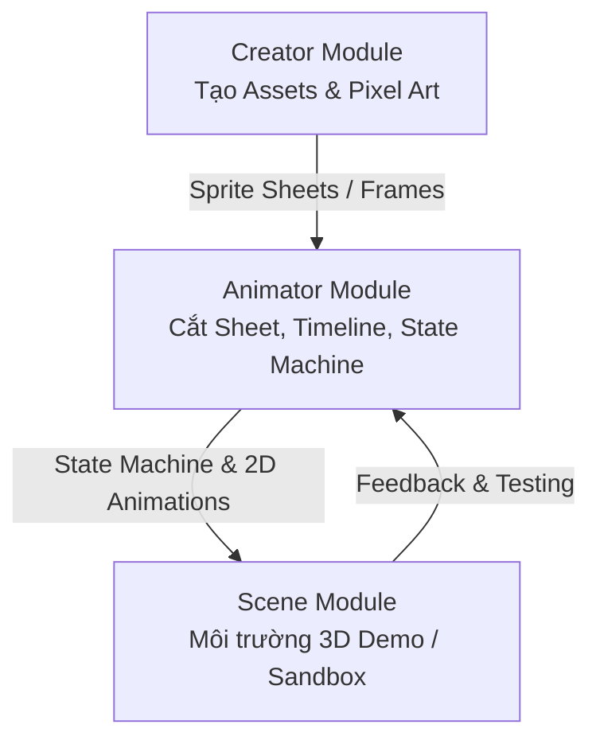

# G.R.I.D. Studio — Design System & Component Guidelines

> **System Design Rule for Agents & Pair Programmers**  
> Quy chuẩn thiết kế giao diện (UI/UX), hệ thống thành phần (Component System), và kiến trúc 3 Module (`Creator`, `Animator`, `Scene`) của dự án G.R.I.D.

---

## 1. Tổng quan Kiến trúc 3 Module (Workspace Architecture)

Hệ thống được tổ chức thành 3 module chính độc lập nhưng liên kết chặt chẽ qua dữ liệu dùng chung:



1. **Module 1: Creator**
   - Chuyên trách tạo, xử lý và tạo sinh tài nguyên đồ họa (assets, character sheets).
   - Tích hợp các bộ lọc đồ họa (Pixelated, Dithering, Color Palette Remapping, Outline, Normal Map generator).
   - Xuất tài nguyên sang Animator dưới dạng `sheets` và `frames`.

2. **Module 2: Animator**
   - Module hiện tại: Chuyên sâu về hoạt ảnh 2D và máy trạng thái (State Machine).
   - CanvasWorkspace (cắt khung, multi-sheet tabs, integer zoom).
   - FrameProperties (quản lý thuộc tính frame, anchor pad 3x3 cho điểm tựa pivot).
   - AnimationPreview (player 60fps, 4-way character locomotion, D-Pad ảo).
   - FrameTimeline (Godot 4 SpriteFrames bottom dock, reorder, FPS).
   - StateGraphModal (Unity Mecanim visual node graph, conditions, parameters).

3. **Module 3: Scene (3D Game Demo Sandbox)**
   - Môi trường 3D tương tác (Three.js / WebGL).
   - Đưa nhân vật 2D vào không gian 3D dưới dạng Billboard 2.5D / HD-2D.
   - Nhân vật chuyển động (WASD + Space) bằng logic của Animator State Machine.
   - Cung cấp sàn (ground terrain), ánh sáng (directional + ambient), đổ bóng, camera điều khiển (Orbit / Follow Cam).

---

## 2. Hệ thống Design Tokens & Màu sắc (Visual Tokens)

Giao diện áp dụng phong cách **Dark-mode Game Studio IDE** (kết hợp tiêu chuẩn của Godot 4, Unity Mecanim và Linear).

### 2.1. Bảng màu (Color Palette)

| Token Name | Giá trị CSS | Mục đích sử dụng |
| :--- | :--- | :--- |
| `--bg-dark` | `#070a13` | Màu nền chính của ứng dụng |
| `--bg-darker` | `#04060a` | Nền modal overlay, dropdowns |
| `--panel-bg` | `rgba(15, 22, 36, 0.88)` | Nền panel kính (glassmorphic) |
| `--panel-bg-solid` | `#0f1624` | Nền panel đặc |
| `--panel-border` | `rgba(255, 255, 255, 0.09)` | Đường viền mặc định của panel/card |
| `--panel-border-bright` | `rgba(255, 255, 255, 0.18)` | Đường viền hover / highlight |
| `--primary` | `#3b82f6` (Blue-500) | Nút hành động chính, tab đang chọn, transition |
| `--accent-green` | `#10b981` (Emerald-500) | Trạng thái Live, Playback, Entry node |
| `--accent-amber` | `#f59e0b` (Amber-500) | Nút Action/Space, port kết nối, pivot feet |
| `--accent-purple` | `#8b5cf6` (Purple-500) | Tham số Bool/Trigger, OneShot clip, brand gradient |
| `--accent-rose` | `#f43f5e` (Rose-500) | Nút xóa, thao tác nguy hiểm (Destructive) |
| `--accent-cyan` | `#06b6d4` (Cyan-500) | Node AnyState, tham số Int |
| `--text-main` | `#f8fafc` (Slate-50) | Chữ tiêu đề, text hiển thị chính |
| `--text-muted` | `#94a3b8` (Slate-400) | Nhãn, label, chú thích phụ |
| `--text-dim` | `#64748b` (Slate-500) | Phím tắt, giá trị không kích hoạt |

### 2.2. Typography

- **Phông chữ giao diện (UI Font)**: `'Plus Jakarta Sans', sans-serif`
  - Sử dụng cho headers, menu, labels, button text.
- **Phông chữ mã/kỹ thuật (Technical/Mono Font)**: `'JetBrains Mono', monospace`
  - Áp dụng bắt buộc cho: Tọa độ (`x`, `y`, `w`, `h`), FPS, Frame count, Parameters, Condition expressions, kbd shortcuts.
- **Thang kích thước chữ**:
  - `text-[9px]` & `text-[10px]`: Badge, label phụ, tick ruler, kbd.
  - `text-xs` (`0.75rem` / 12px): Standard body, button text, input text.
  - `text-sm` (`0.875rem` / 14px): Modal header, panel title.
  - `text-base` (`1rem` / 16px): Main title, branding.

### 2.3. Bán kính bo góc (Border Radius) & Hiệu ứng đổ bóng

- `--radius-xs`: `4px` | `--radius-sm`: `6px` | `--radius-md`: `10px` | `--radius-lg`: `14px` | `--radius-xl`: `18px`
- Glassmorphic backdrop: `backdrop-filter: blur(16px)`
- Custom Scrollbar: Rộng 6px, thumb `rgba(255, 255, 255, 0.18)` bo góc tròn.

---

## 3. Quy chuẩn Thành phần Giao diện (Component Standards)

### 3.1. Quy chuẩn Nút Bấm & Chống Vỡ Layout (Button Sizing & Anti-Breakage Standards)

Mọi nút bấm trong toàn bộ ứng dụng (kể cả Creator, Animator, Scene) **bắt buộc tuân thủ 3 tầng kích thước chuẩn sau để chống vỡ layout và tiết kiệm diện tích**:

| Tầng kích thước | Chiều cao / Kích thước | Padding & Font | Mục đích & Phạm vi áp dụng |
| :--- | :--- | :--- | :--- |
| **Micro / Icon-only** | `24px × 24px` (`h-6 w-6`) | `p-1`, icon 12-13px | Nút cọ vẽ (1p-6p), Palette swatch, nút đóng/thu nhỏ, undo/redo |
| **Standard Toolbar** | `28px` (`h-7`) | `px-2 py-1`, `text-xs` (11-12px) | Nút công cụ T-Panel, nút timeline, tabs điều hướng, dropdowns |
| **Primary / CTA** | `32px` (`h-8`) | `px-3 py-1.5`, `text-xs font-bold` | Nút hành động chính (Send to Animator, Export, Apply Modal) |

#### ⚠️ 5 Quy tắc Bắt Buộc Khi Thiết Kế Nút Bấm:
1. **Chống gãy chữ (No Line Wrapping)**:
   - Tất cả nút bấm bắt buộc có thuộc tính `whitespace-nowrap flex-shrink-0`. Tuyệt đối không để chữ xuống dòng bên trong nút (ví dụ rớt chữ `1p\nFine`) làm biến dạng chiều cao dòng.
2. **Icon-only với Tooltip trên thanh hẹp**:
   - Các nút chức năng trên thanh Timeline, Tool Shelf (T-Panel) hoặc hàng công cụ hẹp **phải ưu tiên dạng Icon-only kèm title/tooltip** (ví dụ nút Duplicate dùng icon `<Copy size={13} />`, nút Delete dùng `<Trash2 size={13} />`), cấm để nguyên chữ dài `Duplicate Frame` làm tràn chiều ngang.
3. **Phân bổ Viewport Budget (Không lãng phí diện tích)**:
   - **Đỉnh màn hình (Top)**: Tối đa 1 Header chính (`44px` / `h-11`) và 1 thanh ngữ cảnh công cụ Tool Context Bar (`30px` / `h-7.5`). Tuyệt đối **không được xếp chồng 3 tầng header** gây lấn chiếm không gian canvas.
   - **Cột công cụ trái (Left T-Panel)**: Rộng cố định `38px - 42px`, chứa icon xếp dọc thẳng hàng.
   - **Cột thuộc tính phải (Right N-Panel)**: Rộng cố định `280px - 300px`, padding tối đa `p-2.5` để dành trọn diện tích cho Canvas Viewport.
   - **Thanh Timeline đáy (Bottom Dock)**: Chiều cao chuẩn `44px - 48px`, các nút sắp xếp gọn gàng theo chiều ngang.
4. **Quy chuẩn Grid cho Swatches & Options (Chống rớt 1 cột dọc)**:
   - Bảng màu swatches, các nút chọn màu outline, hoặc danh sách density **bắt buộc dùng layout lưới đa cột rõ ràng** (ví dụ: `display: grid; gridTemplateColumns: repeat(8, 1fr); gap: 4px;` cho 16 màu thành 2 hàng 8 cột, cao $\le 56\text{px}$). Tuyệt đối không dùng dynamic class thiếu style làm rớt thành 1 cột dọc 16 hàng chiếm 600px!
5. **Đồng nhất chiều cao hàng (Consistent Row Height)**:
   - Khi xếp nhiều nút cạnh nhau trên 1 hàng (`flex items-center`), tất cả nút trong hàng phải có cùng chiều cao (ví dụ cùng `h-6` hoặc `h-7`). Không trộn lẫn nút có padding `py-0.5` với nút `py-2.5`.

### 3.2. Form Inputs & Selects

- Luôn dùng `.input-field` với font monospace:
  - Chiều cao: `28px` (hoặc `.input-field-sm` `24px`).
  - Nền: `rgba(11, 16, 28, 0.9)`, viền `rgba(255, 255, 255, 0.12)`.
  - Focus: Viền `--primary` (`#3b82f6`) với glow shadow `0 0 0 2px rgba(59, 130, 246, 0.4)`.
- Nhãn label đi kèm: `.input-label` (10px uppercase, font-bold, text-slate-400).

### 3.3. Huy hiệu & Trạng thái (Badges)

Sử dụng cấu trúc huy hiệu chuẩn `.badge .badge-{color}` với font JetBrains Mono in hoa:
- `.badge-blue`: Thông số float, clip ID, số lượng frames.
- `.badge-emerald`: Trạng thái đang chạy, kết nối thành công, Entry.
- `.badge-amber`: Cảnh báo, hành động Action/Trigger, Default state.
- `.badge-slate`: Trạng thái phụ, frame index `01 / 08`.

### 3.4. Modal & Dialog Overlay

- Luôn dùng `createPortal(..., document.body)` để tách biệt DOM.
- Cấu trúc 3 tầng:
  1. `.modal-overlay`: Phủ toàn màn hình, mờ hậu cảnh `blur(12px)`.
  2. `.modal-card`: Rộng tối đa 600px - 1200px (tùy modal), bo viền 18px.
  3. `.modal-header` (có nút `X`), `.modal-body` (cuộn nội dung), `.modal-footer` (các nút Done / Apply / Cancel).

### 3.5. Pivot Point Anchor Pad (Bộ chọn điểm tựa 3x3)

- Lưới 3x3 (`.anchor-pad`) đại diện cho:
  - Top-Left (0,0), Top-Center (0.5,0), Top-Right (1,0)
  - Center-Left (0,0.5), Center (0.5,0.5), Center-Right (1,0.5)
  - Bottom-Left (0,1), Bottom-Center/Feet (0.5,1), Bottom-Right (1,1)
- Điểm được kích hoạt có class `.active` (màu hổ phách `--accent-amber`).

---

## 4. Quy chuẩn Đồ họa Pixel Art & Canvas (Rendering Guidelines)

1. **Hiển thị Pixel sắc nét (Crisp Rendering)**:
   - Tất cả ảnh sprite sheet, canvas preview, thumbnail frames bắt buộc bật thuộc tính:
     ```css
     image-rendering: pixelated;
     ```
   - Trên thẻ `<canvas>`: luôn set `ctx.imageSmoothingEnabled = false`.

2. **Nền trong suốt (Transparency)**:
   - Sử dụng `.bg-checkerboard` (ô caro 16x16px giữa `#0f172a` và `#1e293b`) để người dùng luôn nhận biết được vùng pixel trong suốt.

3. **Tỉ lệ khung hình (Aspect Ratio)**:
   - Luôn duy trì tỉ lệ 1:1 cho pixel của frame khi scale trong view preview để tránh méo sprite.

---

## 5. Quy tắc Quản lý Trạng thái & Hiệu năng (Performance Rules)

1. **Vòng lặp 60 FPS (Tick Loop)**:
   - Các tác vụ animation, character physics, 3D render loop **không được dùng React State** cho từng frame chuyển động.
   - Bắt buộc dùng `useRef` (e.g. `charPosRef`, `frameAccRef`, `stateMachineRef`) kết hợp `requestAnimationFrame(loop)` để đảm bảo render 60 FPS mượt mà không gây re-render React thừa.
   - Chỉ đồng bộ sang React State khi chuyển trạng thái (ví dụ đổi State ID từ `Idle` sang `Run`).

2. **Định dạng Schema Dữ liệu chuẩn**:
   - `Frame`: `{ id, sheetId, name, x, y, w, h, pivotX, pivotY }`
   - `Animation`: `{ id, name, fps, loop, frameIds: [] }`
   - `Sheet`: `{ id, name, imageSrc, imageDimensions: { width, height }, imageElement }`
   - `GraphConfig`: `{ name, parameters, parameterTypes, defaultState, states, transitions }`

3. **Bàn phím & Phím tắt (Keyboard Navigation)**:
   - Phím WASD / Mũi tên: Di chuyển nhân vật 4 hướng.
   - Phím Space: Kích hoạt Action/Attack state.
   - Phím Del/Backspace: Xóa frame hoặc node đang chọn.
   - Phím Ctrl+A / Ctrl+D: Chọn tất cả / Bỏ chọn frame.
