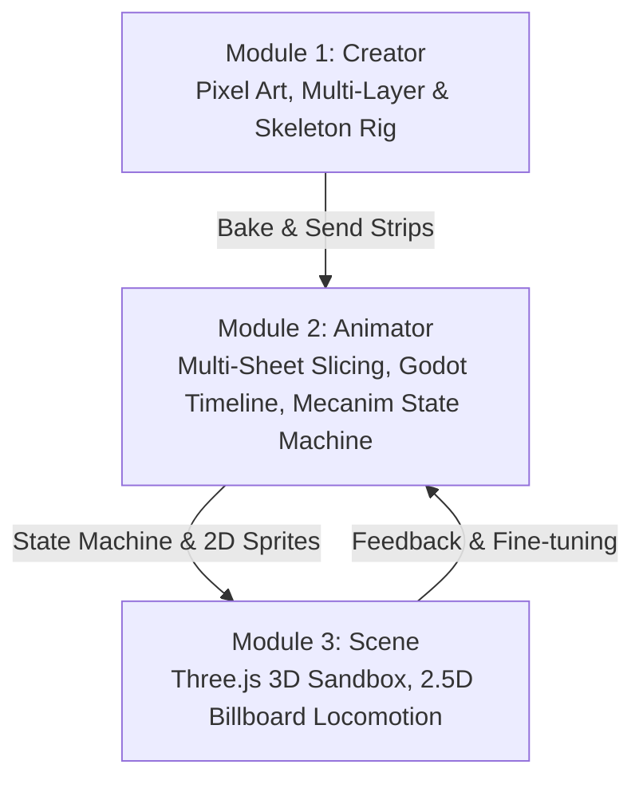

# G.R.I.D. — Graphics Rendering for Independent Developers

[](LICENSE)
[](https://react.dev)
[](https://vite.dev)
[](https://threejs.org)

**G.R.I.D.** (**G**raphics **R**endering for **I**ndependent **D**evelopers) is a professional, high-performance web-based game studio IDE for 2D/2.5D indie game developers. It features a unified 3-module workflow: asset creation with layers & skeleton rigs, animation state machines, and a real-time 3D sandbox.

---

## 🏛️ 3-Module Studio Architecture



---

## ✨ Studio Modules & Feature Guide

### 🎨 Module 1: Creator (Pixel Art Studio, Layer System & 2D/3D Skeleton Rig)

Công cụ tạo sinh tài nguyên đồ họa pixel art chuyên sâu với đầy đủ tính năng của các phần mềm đồ họa chuyên nghiệp (Aseprite, Blender, Spine2D):

#### 1. Pixel Canvas Editor & Viewport
- **Công cụ cọ vẽ chuẩn studio**: `Pencil` (P), `Eraser` (E), `Paint Bucket` (G), `Eyedropper` (I), `Hand/Pan` (H hoặc giữ phím `Space`).
- **Kích thước nét cọ**: `1px`, `2px`, `3px`, `4px`, `6px`.
- **Đối xứng gương (Mirror Symmetry)**: Vẽ phản chiếu qua trục X chỉ với 1 phím tắt (`X`).
- **Pixel Grid thông minh**: Lưới pixel sắc nét bật/tắt tùy ý (`#`), tự động kích hoạt khi phóng to $\ge 400\%$.
- **Integer Zoom & Smooth Pan**: Thu phóng từ $100\% \to 6400\%$ neo theo vị trí con trỏ chuột, nút `Fit` vừa vặn màn hình.
- **Lịch sử Undo/Redo**: Lưu lịch sử 25 bước thao tác (`Ctrl + Z` / `Ctrl + Y`).

#### 2. Hệ thống Layer Đa Tầng (Multi-Layer System)
- **Layer Stack Manager**: Quản lý ngăn xếp layer ở tab `Layers` của N-Panel bên phải.
- **Thao tác Layer**:
  - `+ Add`: Thêm layer trong suốt mới.
  - `Copy`: Nhân bản layer đang chọn cùng toàn bộ pixel.
  - `Merge Down`: Gộp layer hiện tại xuống layer bên dưới.
  - `Reorder (▲ / ▼)`: Di chuyển thứ tự hiển thị của các layer trong stack.
  - `Delete`: Xóa layer không dùng (luôn giữ tối thiểu 1 layer).
  - `Rename`: Double-click vào tên layer để chỉnh sửa trực tiếp.
- **Kiểm soát hiển thị & Bảo vệ**:
  - `Eye`: Bật/tắt ẩn hiện layer tức thì.
  - `Lock`: Khóa layer chống vẽ nhầm pixel.
  - `Opacity Slider`: Thanh trượt độ trong suốt $0\% \to 100\%$.
- **Vẽ độc lập**: Các nét vẽ chỉ áp dụng trên **Active Layer**, tự động tổng hợp (Composite) từ dưới lên trên bằng thuật toán Nearest-Neighbor sắc nét.

#### 3. Hệ thống Skeleton Rig 2D/3D (Hierarchical Forward Kinematics)
- **Cấu trúc xương phân cấp (Parent-Child FK)**:
  - Cho phép pose nhân vật theo các khớp nối (ví dụ: `Root` $\to$ `Torso` $\to$ `Head`; `Torso` $\to$ `Arm` $\to$ `Weapon`; `Root` $\to$ `Legs`). Khi xoay xương cha, các xương con và layer liên kết tự động xoay và di chuyển theo.
- **On-Canvas Skeleton Gizmo**:
  - Khung xương hiển thị trực quan dạng hình thoi 3D octahedral ngay trên Canvas.
  - Kéo trực tiếp đầu xương (`Tip Handle`) trên màn hình để xoay góc linh hoạt.
  - Kéo gốc khớp (`Joint Ball`) để di chuyển tâm xoay hoặc dời vị trí nhân vật.
- **Gán Layer theo Xương (Bone-to-Layer Binding)**:
  - Từng đốt xương có thể liên kết với một Layer cụ thể (ví dụ: xương `Head` gắn với layer `Head`, xương `Arm (Right / Weapon)` gắn với layer `Arms & Weapon`).
  - Nút **`Auto-Bind`**: Tự động so khớp tên layer và tên xương chỉ bằng 1 click.
- **Bộ xương mẫu (Built-in Presets)**:
  - **Humanoid Biped**: Khung xương người 2 chân đầy đủ (Root, Torso, Head, 2 Tay, 2 Chân).
  - **Quadruped**: Khung xương thú 4 chân (Thân, Cổ/Đầu, 4 Chân, Đuôi).
  - **Limb Chain**: Chuỗi 3 đốt khớp mềm dẻo cho xúc tu, đuôi, tóc hoặc vũ khí.

#### 4. ⚡ Tạo Frame Mới từ Frame Có Sẵn (`Bake Pose as New Frame`)
- **Quy trình tạo animation cực nhanh**:
  1. Chọn frame gốc trên Timeline filmstrip.
  2. Bật chế độ `Pose & Rig Mode` (hoặc chuyển sang tab `Rig`).
  3. Xoay các đốt xương theo dáng mong muốn (cánh tay vung lên, chân bước tới, đầu cúi).
  4. Nhấn **`⚡ Bake Pose as New Frame`**: Hệ thống tự động biến đổi pixel của các layer theo góc xương bằng thuật toán Nearest-Neighbor (giữ độ sắc nét pixel art, không bị nhòe mờ) và sinh ra một frame mới ngay bên cạnh trên Timeline!
  5. Xem trước hoạt ảnh chuyển động ngay lập tức ở tốc độ 8 FPS.

#### 5. Bộ Lọc Đồ Họa & Preset Sinh Tự Động
- **Color Palettes**: Bảng màu kinh điển PICO-8, Game Boy, NES, Commodore 64, Cyberpunk Neon, Endesga 32,...
- **Dithering Engine**: Không dither, Floyd-Steinberg, Bayer 4×4, Bayer 8×8.
- **Pixel Outline**: Tạo viền pixel tự động (Đen, Trắng, Vàng, Cyan, Đỏ).
- **Procedural Presets**:
  - `Knight HD`: Nhân vật hiệp sĩ 5 layer phân tách sẵn (`Cape & Shadow`, `Legs`, `Torso`, `Head`, `Arms & Weapon`) gắn sẵn khung xương Biped.
  - `Emerald Slime`: Slime nảy chuyển động nhịp nhàng.
  - `Gold Coin`: Đồng xu vàng xoay 3D.
  - `Ethereal Ghost`: Bóng ma bay lơ lửng.

---

### 🎬 Module 2: Animator (Multi-Sheet Slicing, Timeline & Mecanim State Machine)

Module chuyên sâu về hoạt ảnh 2D và máy trạng thái hoạt họa chuẩn studio:

#### 1. Canvas Workspace & Multi-Sheet Slicing
- **Quản lý đa sheet đồng thời**: Làm việc với nhiều sprite sheet cùng lúc trong một dự án (Idle, Run, Attack, Hurt).
- **Cắt khung linh hoạt**:
  - Kéo thả tự do bằng chuột với độ chính xác từng pixel.
  - Cắt lưới tự động theo Hàng × Cột hoặc Kích thước ô (Grid Slicer).
  - Tự động nhận diện ranh giới sprite bằng thuật toán kênh Alpha (Auto-Detect).
  - Nhân bản frame nhanh bằng phím tắt `Ctrl + D`.
- **Anchor Pad 3x3**: Thiết lập điểm tựa pivot chân thực (`Bottom-Center`, `Center`, `Top-Left`,...).

#### 2. Godot 4 SpriteFrames Timeline Dock
- **Cột trái (Animations List)**: Quản lý danh sách clips, điều chỉnh tốc độ FPS, vòng lặp Loop, tự động nhóm 4 hướng di chuyển (`run_down`, `run_up`, `run_left`, `run_right`).
- **Cột phải (Frames Track)**: Danh sách thẻ frame có thumbnail, chỉ số index, thời lượng duration multiplier, đổi thứ tự kéo thả.
- **Dock Player**: Trình phát hoạt ảnh trực tiếp ở thanh đáy với phím Play/Pause và FPS mượt mà.

#### 3. Unity Mecanim Visual Node Graph
- **Đồ thị trạng thái trực quan**: Kéo thả các node `Entry`, `AnyState`, `Idle`, `Run`, `Attack` trên lưới canvas vô cực.
- **Transition & Parameters**: Tạo mũi tên chuyển tiếp giữa các trạng thái với các điều kiện logic (`speed > 0.1`, `isAttacking == true`, `moveX`, `moveY`).
- **Live State Pulse**: Viền phát sáng nhịp nhàng và thanh tiến trình phản ánh trạng thái hoạt động thực thời khi nhân vật di chuyển.

#### 4. Playable Character Preview 60 FPS
- **Arena điều khiển nhân vật**: Thử nghiệm chuyển động ngay trong studio bằng phím `WASD` / Mũi tên và phím `Space` (hành động).
- **Locomotion 4 hướng**: Tự động chuyển đổi hướng nhìn và tư thế chạy theo vận tốc thực tế của người chơi.

---

### 🌐 Module 3: Scene (3D WebGL Sandbox & Billboard Locomotion)

Đưa hoạt ảnh pixel 2D vào không gian 3D tương tác theo phong cách **HD-2D / 2.5D**:

- **Đồ họa Three.js / WebGL**: Môi trường không gian 3D với hệ thống camera điều khiển (Orbit / Follow Cam), ánh sáng đổ bóng chân thực (Directional + Ambient Light) và mặt đất (Terrain Grid).
- **Billboard 2.5D Sprite**: Nhân vật 2D tự động hướng về phía camera hoặc cố định theo góc nhìn isometric.
- **Đồng bộ State Machine**: Nhân vật trong không gian 3D di chuyển (`W`, `A`, `S`, `D`, `Space`) và kích hoạt chuyển động hoạt ảnh trực tiếp từ State Machine của Animator Module!

---

## 📦 Xuất & Nhập Tài Nguyên (Import & Export)

- **Gửi trực tiếp Creator sang Animator**: Nhấn nút `Send to Animator` ở Creator Module để tự động chuyển toàn bộ dải frame sang Animator cắt sheet và thiết lập timeline.
- **Import Sheet Atlas**: Hỗ trợ metadata từ **TexturePacker** (Hash & Array), **Phaser 3**, **Aseprite** (kèm `frameTags`), **Unity Sprite Atlas**.
- **Export Engine Data**:
  - **Unity Mecanim**: Xuất file `.controller` tương thích Unity Animator Controller 2D BlendTree.
  - **Godot 4.x**: Xuất file `.tres` tương thích Godot `AnimationNodeStateMachine`.
  - **Atlas JSON & PNG**: Xuất ảnh sprite sheet PNG và file JSON tọa độ cho Phaser, PixiJS, Pygame, Raylib.
  - **ZIP Archive**: Tải về toàn bộ từng frame ảnh đơn lẻ đóng gói dạng ZIP.

---

## 🚀 Hướng Dẫn Cài Đặt & Khởi Chạy

### Yêu cầu môi trường
- **Node.js**: Phiên bản 18 trở lên.
- **npm** (hoặc `pnpm` / `yarn`).

### Cài đặt và chạy Local Dev Server

```bash
# Clone source code
git clone git@github.com:wdvn/grid.git
cd grid

# Cài đặt các thư viện phụ thuộc
npm install

# Khởi động server phát triển
npm run dev
```

Mở trình duyệt truy cập: [http://localhost:5173](http://localhost:5173)

### Kiểm tra cú pháp và Build Production

```bash
# Kiểm tra linter
npm run lint

# Đóng gói sản phẩm production
npm run build

# Chạy thử bản production
npm run preview
```

---

## ⌨️ Bảng Phím Tắt Tiện Dụng (Shortcuts Cheat Sheet)

| Phím tắt | Phạm vi áp dụng | Chức năng |
| :--- | :--- | :--- |
| `Alt + 1` / `F1` | Toàn hệ thống | Chuyển sang Module Creator |
| `Alt + 2` / `F2` | Toàn hệ thống | Chuyển sang Module Animator |
| `Alt + 3` / `F3` | Toàn hệ thống | Chuyển sang Module Scene 3D |
| `P` | Creator | Chọn công cụ Bút vẽ (Pencil) |
| `E` | Creator | Chọn công cụ Cọ tẩy (Eraser) |
| `G` | Creator | Chọn thùng sơn đổ màu (Paint Bucket) |
| `I` | Creator | Chọn ống hút màu (Eyedropper) |
| `H` / `Space` | Creator / Animator | Công cụ Hand kéo rê khung nhìn (Pan) |
| `B` / `R` | Creator | Bật / tắt chế độ Pose & Skeleton Rig |
| `X` | Creator | Bật / tắt chế độ vẽ đối xứng gương qua trục X |
| `#` hoặc `\` | Creator | Bật / tắt lưới Pixel Grid |
| `[` / `]` | Creator | Giảm / tăng kích thước cọ vẽ |
| `1` - `6` | Creator | Chọn nhanh kích thước nét cọ (1p, 2p, 3p, 4p, 6p) |
| `F` / `0` | Creator | Căn vừa khung vẽ vào màn hình (Fit Zoom) |
| `Enter` | Creator (Rig Mode) | Nướng dáng pose thành frame mới (Bake Pose) |
| `Ctrl + Z` | Toàn hệ thống | Hoàn tác (Undo) |
| `Ctrl + Y` / `Ctrl+Shift+Z` | Toàn hệ thống | Làm lại (Redo) |
| `Ctrl + D` | Animator / Creator | Nhân bản frame đang chọn |
| `Delete` / `Backspace` | Toàn hệ thống | Xóa frame hoặc node đang chọn |
| `WASD` / `Mũi tên` | Animator / Scene | Điều khiển nhân vật di chuyển 4 hướng |
| `Space` | Animator / Scene | Kích hoạt hành động Attack / Action state |

---

## 📄 Bản quyền (License)

Dự án được phát hành theo giấy phép **BSD 3-Clause License** — xem chi tiết tại [LICENSE](LICENSE).

Copyright (c) 2026, **wdvn** <nguyenthanhluynd@gmail.com>.
